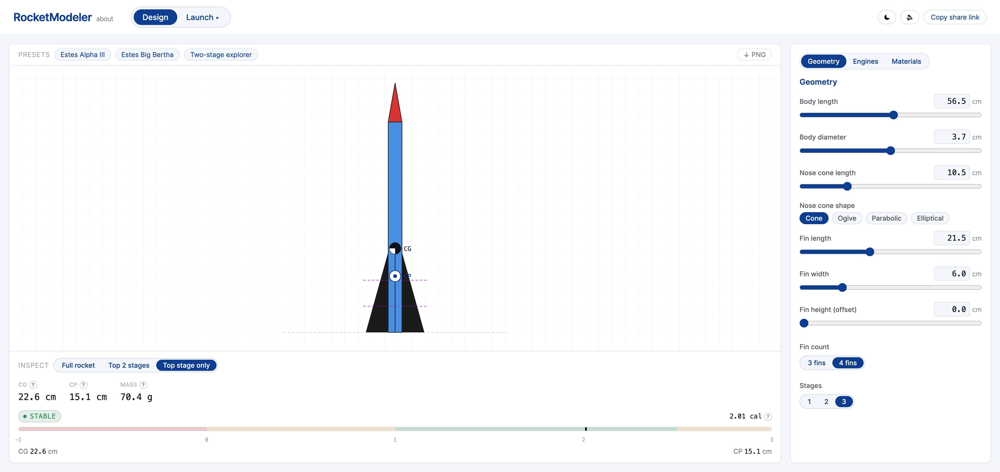
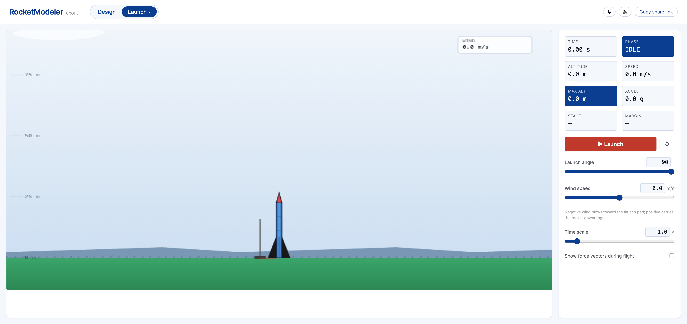

# RocketModeler

## Intro

A model rocket sandbox in the browser. You design a paper-style rocket
in one view, then put it on a launchpad in the other and watch it fly.
Live at https://rocketmodeler.harshcasper.dev/.

The design view exposes the rocket parameters that matter for stability
and altitude: body length and diameter, nose cone length and shape, fin
length, width, count and offset, stage count, engine choice per stage,
materials and parachute size. As you change them, the centre of
gravity, centre of pressure, total mass and stability caliber update in
real time, with a coloured gauge telling you whether the design is
overstable, stable, marginal or unstable.

The launch view runs the rocket in a real flight simulation. The
engine produces thrust through its published burn curve, mass drops as
fuel burns, the parachute deploys at ejection, atmospheric density
drops with altitude, the launch rod constrains motion for the first
110 cm, and aerodynamic torque turns the nose into the relative wind so
gravity turn and weathercocking emerge naturally. A HUD reports
altitude, speed, g-force and live stability margin, and after landing
a summary modal lists apogee, peak speed, peak g, time to apogee and
total flight time with altitude, speed and acceleration charts.

| Design view | Launch view |
| --- | --- |
|  |  |

## Background

It is a TypeScript and React port of the [NASA Glenn Research Center
RocketModeler applet](https://www.grc.nasa.gov/www/k-12/VirtualAero/BottleRocket/airplane/rktsim.html)
that Eric Bishop wrote in Java around 2002. The original needed the
Java browser plugin, which no current browser still ships, so this is
an independent rebuild as a static web app. Not affiliated with NASA.
The original applet is public-domain US Government work.

## Run it

```bash
npm install
npm run dev
npm test
npm run build
```

`npm run dev` serves at http://localhost:5173. `npm test` runs the
vitest suite covering physics and the URL codec. `npm run build`
writes a production bundle to `./dist`.

## Design view

The rocket is drawn as an SVG. Hover the body to reveal drag handles on
the nose tip, body length, fin length and fin width. The right sidebar
has sliders for the same parameters plus fin count, stage count,
materials, drag coefficient, payload mass and parachute size. Nose
shape is one of cone, ogive, parabolic or elliptical, and the Barrowman
CP recomputes for the chosen shape.

The preset menu has Estes Alpha III, Big Bertha and a two-stage
explorer. Each engine in the catalog renders a small thrust curve and
its total impulse next to the dropdown. The caliber gauge widens its
range when a design is overstable so the needle stays on the bar.

## Launch view

Canvas2D scene with a chase camera. Two cloud layers drift at different
speeds, low hills sit on the horizon, and the launch rod stands to the
left of the rocket with an ignition wire running to the base. While the
rocket is still on the rod (the first 110 cm of axial travel) its
velocity is projected onto the rod axis. After it clears the rod, a
heading alignment term turns the nose toward the relative wind
direction; stiffness scales with dynamic pressure and stability margin.
Gravity turn and weathercocking both fall out of this without a full
moment-of-inertia integration.

The HUD shows time, phase, altitude, speed, g-force, max altitude,
stage and live stability margin. A trail traces the trajectory and a
smoke plume drifts in the wind during boost. Mach 1, apogee and
parachute deployment surface as caption banners with timestamps. Force
vectors for thrust, gravity and velocity can be turned on from the
controls panel.

After landing the summary modal lists apogee, peak speed, peak g, time
to apogee and total flight time, with altitude, speed and acceleration
charts. A replay button plays the recorded samples back at 1x with a
scrub bar for stopping at a specific moment. A "Skip to landing"
control fast-forwards through the parachute descent if you do not want
to wait it out.

## Keyboard

`D` opens the design view, `L` the launch view, `Space` starts or
pauses a flight, `R` resets, `?` opens the about dialog.

## Sharing

Every design edit gzips into the URL hash, so the address bar is the
shareable snapshot. The last session and the dark mode preference are
kept in `localStorage`.

## Physics

CG is the mass-weighted port of the original calculation across the
nose cone, body tube, fins, engines and payload. The same calculation
runs in flight, which is what makes the live CG in the HUD shift with
fuel burn and stage drop.

CP is Barrowman with shape-dependent nose terms. `X_n` is 0.667 L for a
cone, 0.466 L for an ogive, 0.5 L for a parabolic, 0.333 L for an
elliptical nose. The fin term is the closed form for triangular delta
fins with body-fin interference `K_fb = 1 + R/(s+R)`.

Atmosphere is the ISA troposphere, valid to 11 km.

The integrator is semi-Euler at 100 sub-steps per visible frame
(`dt = 0.045 s`). Code lives under `src/physics/`.

## Credit

Eric Bishop wrote the original applet at Ohio State University working
with NASA Glenn Research Center. This rebuild is by [@HarshCasper](https://github.com/HarshCasper).
MIT licensed; see `LICENSE`.
